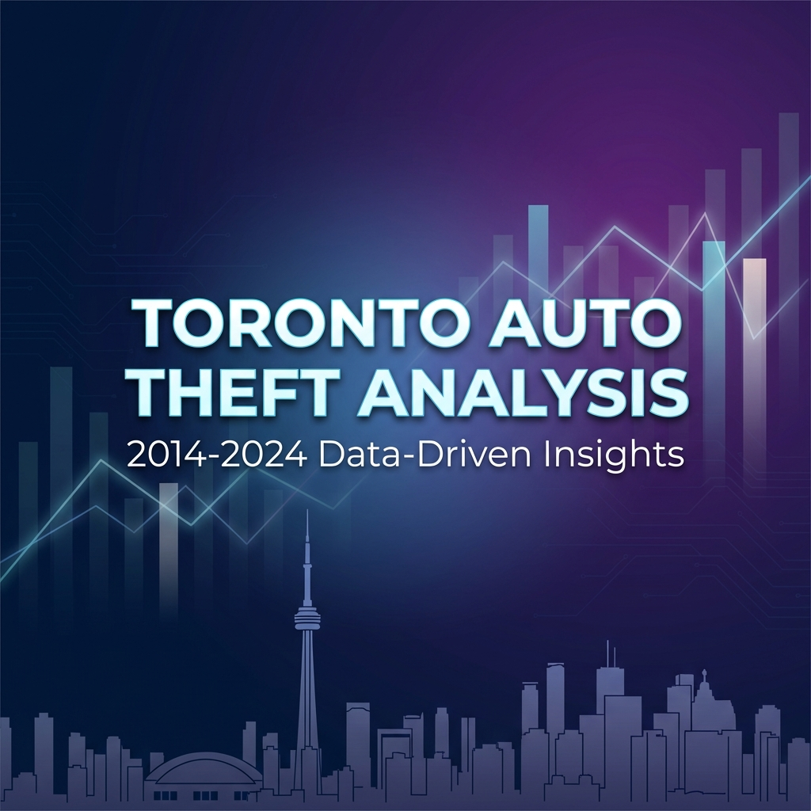
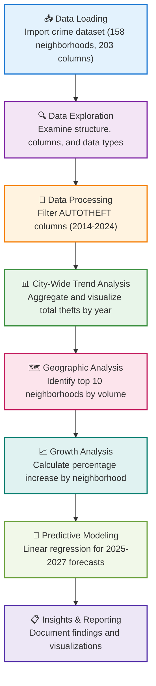

<a id="readme-top"></a>

<!-- PROJECT SHIELDS -->
[![LinkedIn][linkedin-shield]][https://www.linkedin.com/in/prgya-kapur/]

<!-- PROJECT BANNER -->
<div align="center">
  
</div>

<br />

<!-- PROJECT LOGO -->
<br />
<div align="center">
  <h3 align="center">Toronto Auto Theft Analysis (2014-2024)</h3>

  <p align="center">
    A comprehensive data analysis project examining auto theft trends across Toronto neighborhoods
    <br />
    <a href="#about-the-project"><strong>Explore the analysis »</strong></a>
    <br />
    <br />
    <a href="Toronto Auto Theft Analysis.pdf">View Report</a>
    ·
    <a href="Auto_theft_eda.ipynb">View Notebook</a>
  </p>
</div>

<!-- TABLE OF CONTENTS -->
<details>
  <summary>Table of Contents</summary>
  <ol>
    <li>
      <a href="#about-the-project">About The Project</a>
      <ul>
        <li><a href="#built-with">Built With</a></li>
      </ul>
    </li>
    <li>
      <a href="#getting-started">Getting Started</a>
      <ul>
        <li><a href="#prerequisites">Prerequisites</a></li>
        <li><a href="#installation">Installation</a></li>
      </ul>
    </li>
    <li><a href="#usage">Usage</a></li>
    <li><a href="#project-structure">Project Structure</a></li>
    <li><a href="#key-findings">Key Findings</a></li>
    <li><a href="#methodology">Methodology</a></li>
    <li><a href="#license">License</a></li>
    <li><a href="#contact">Contact</a></li>
    <li><a href="#acknowledgments">Acknowledgments</a></li>
  </ol>
</details>

<!-- ABOUT THE PROJECT -->
## About The Project

This project performs an **Exploratory Data Analysis (EDA)** on auto theft incidents across various Toronto neighborhoods over an 11-year period (2014-2024). The goal is to identify temporal trends, high-risk geographic areas, and provide forecasts for future years to help understand the evolving landscape of property crime in Toronto.

### Research Questions

* How has the total number of auto thefts in Toronto changed between 2014 and 2024?
* Which neighborhoods consistently report the highest volume of auto thefts?
* Which areas have seen the most significant percentage increase in thefts over the last decade?
* What is the projected trend for auto thefts in the coming years (2025–2027)?

### Key Objectives

1. Clean and isolate auto theft-specific data from comprehensive crime dataset
2. Visualize the city-wide trend from 2014 to 2024
3. Identify the top 10 neighborhoods by total theft volume and current theft rates
4. Calculate and rank neighborhoods by the highest percentage growth in incidents
5. Build a linear regression model to forecast future theft numbers

<p align="right">(<a href="#readme-top">back to top</a>)</p>

### Built With

This project leverages the following Python libraries and tools:

* [![Python][Python-badge]][Python-url]
* [![Pandas][Pandas-badge]][Pandas-url]
* [![NumPy][NumPy-badge]][NumPy-url]
* [![Matplotlib][Matplotlib-badge]][Matplotlib-url]
* [![Jupyter][Jupyter-badge]][Jupyter-url]

<p align="right">(<a href="#readme-top">back to top</a>)</p>

<!-- GETTING STARTED -->
## Getting Started

To get a local copy up and running, follow these simple steps.

### Prerequisites

* Python 3.8 or higher
* pip (Python package installer)

### Installation

1. Clone the repository
   ```sh
   git clone https://github.com/prgyakapur/Toronto-Auto-Theft-Analysis.git
   ```

2. Navigate to the project directory
   ```sh
   cd Toronto-Auto-Theft-Analysis
   ```

3. Install required packages
   ```sh
   pip install -r requirements.txt
   ```

4. Launch Jupyter Notebook
   ```sh
   jupyter notebook Auto_theft_eda.ipynb
   ```

<p align="right">(<a href="#readme-top">back to top</a>)</p>

<!-- USAGE -->
## Usage

This analysis can be used to:

* **Understand Crime Patterns**: Identify neighborhoods with increasing or decreasing auto theft trends
* **Resource Allocation**: Help law enforcement allocate resources to high-risk areas
* **Policy Making**: Inform policy decisions based on data-driven insights
* **Academic Research**: Serve as a case study for crime analysis and predictive modeling
* **Portfolio Demonstration**: Showcase data cleaning, EDA, and forecasting skills

### Analysis Workflow

The notebook follows a structured approach:



**Workflow Steps:**

1. **📥 Data Loading**: Import and explore the neighborhood crime dataset
2. **🔍 Data Exploration**: Examine dataset structure and identify relevant columns
3. **🧹 Data Processing**: Filter and isolate auto theft-specific columns
4. **📊 Trend Analysis**: Visualize city-wide trends over the 11-year period
5. **🗺️ Geographic Analysis**: Identify and rank high-risk neighborhoods
6. **📈 Growth Analysis**: Calculate percentage changes to find fastest-growing problem areas
7. **🤖 Predictive Modeling**: Build linear regression model for forecasting
8. **📋 Reporting**: Document insights and create final visualizations

<p align="right">(<a href="#readme-top">back to top</a>)</p>

<!-- PROJECT STRUCTURE -->
## Project Structure

```
Toronto-Auto-Theft-Analysis/
├── Auto_theft_eda.ipynb              # Main analysis notebook
├── neighbourhood-crime-rates - 4326.csv  # Raw crime data
├── Data_set.xlsx                     # Original dataset
├── Cleaned Dataset Auto theft.xlsx   # Processed data
├── Toronto Auto Theft Analysis.pdf  # Final report
├── requirements.txt                  # Python dependencies
├── LICENSE                          # MIT License
└── README.md                        # This file
```

<p align="right">(<a href="#readme-top">back to top</a>)</p>

<!-- KEY FINDINGS -->
## Key Findings

The analysis reveals several important insights:

* **Significant Upward Trend**: Auto thefts in Toronto have shown a dramatic increase, particularly from 2020 onwards
* **Geographic Hotspots**: Certain neighborhoods consistently experience higher theft rates
* **Percentage Growth**: Some areas have seen growth rates exceeding 100% over the study period
* **Forecasting**: Linear regression models suggest continued increases if current trends persist

> **Note**: For detailed findings, visualizations, and statistical analysis, please refer to the [Jupyter Notebook](Auto_theft_eda.ipynb) or the [PDF Report](Toronto Auto Theft Analysis.pdf).

<p align="right">(<a href="#readme-top">back to top</a>)</p>

<!-- METHODOLOGY -->
## Methodology

### Data Source

The analysis uses the `neighbourhood-crime-rates - 4326.csv` dataset, which contains:
- 158 Toronto neighborhoods
- 203 columns covering various crime types
- Historical data from 2014 to 2024
- Both raw counts and normalized rates (per 100,000 population)

### Analytical Techniques

* **Exploratory Data Analysis (EDA)**: Statistical summaries and data profiling
* **Time Series Analysis**: Trend identification and pattern recognition
* **Comparative Analysis**: Neighborhood-by-neighborhood comparisons
* **Linear Regression**: Predictive modeling for future projections
* **Data Visualization**: Line plots, bar charts, and trend analysis

### Tools & Technologies

* **Pandas**: Data manipulation and analysis
* **Matplotlib**: Data visualization
* **NumPy**: Numerical computations
* **Jupyter Notebook**: Interactive development environment

<p align="right">(<a href="#readme-top">back to top</a>)</p>

<!-- CONTACT -->
## Contact

Prgyakapur - [@prgyakapur](https://github.com/prgyakapur)

Project Link: [https://github.com/prgyakapur/Toronto-Auto-Theft-Analysis](https://github.com/prgyakapur/Toronto-Auto-Theft-Analysis)

<p align="right">(<a href="#readme-top">back to top</a>)</p>

<!-- ACKNOWLEDGMENTS -->
## Acknowledgments

* [Toronto Police Service](https://www.tps.ca/) for providing comprehensive crime data
* [City of Toronto Open Data Portal](https://open.toronto.ca/) for making data publicly accessible

<p align="right">(<a href="#readme-top">back to top</a>)</p>

<!-- MARKDOWN LINKS & IMAGES -->
[license-shield]: https://img.shields.io/github/license/prgyakapur/Toronto-Auto-Theft-Analysis.svg?style=for-the-badge
[license-url]: https://github.com/prgyakapur/Toronto-Auto-Theft-Analysis/blob/master/LICENSE
[linkedin-shield]: https://img.shields.io/badge/-LinkedIn-black.svg?style=for-the-badge&logo=linkedin&colorB=555
[linkedin-url]: https://linkedin.com/in/prgyakapur

<!-- Technology Badges -->
[Python-badge]: https://img.shields.io/badge/Python-3776AB?style=for-the-badge&logo=python&logoColor=white
[Python-url]: https://www.python.org/
[Pandas-badge]: https://img.shields.io/badge/Pandas-150458?style=for-the-badge&logo=pandas&logoColor=white
[Pandas-url]: https://pandas.pydata.org/
[NumPy-badge]: https://img.shields.io/badge/NumPy-013243?style=for-the-badge&logo=numpy&logoColor=white
[NumPy-url]: https://numpy.org/
[Matplotlib-badge]: https://img.shields.io/badge/Matplotlib-11557c?style=for-the-badge&logo=python&logoColor=white
[Matplotlib-url]: https://matplotlib.org/
[Jupyter-badge]: https://img.shields.io/badge/Jupyter-F37626?style=for-the-badge&logo=jupyter&logoColor=white
[Jupyter-url]: https://jupyter.org/